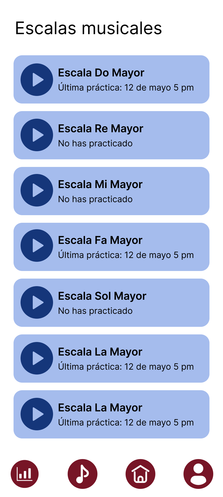
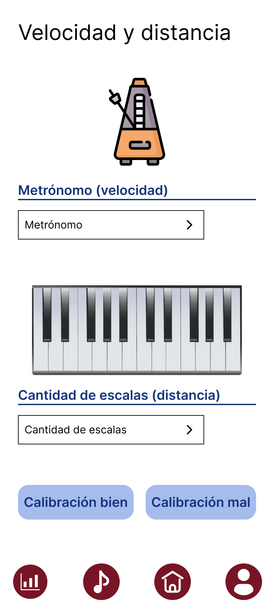
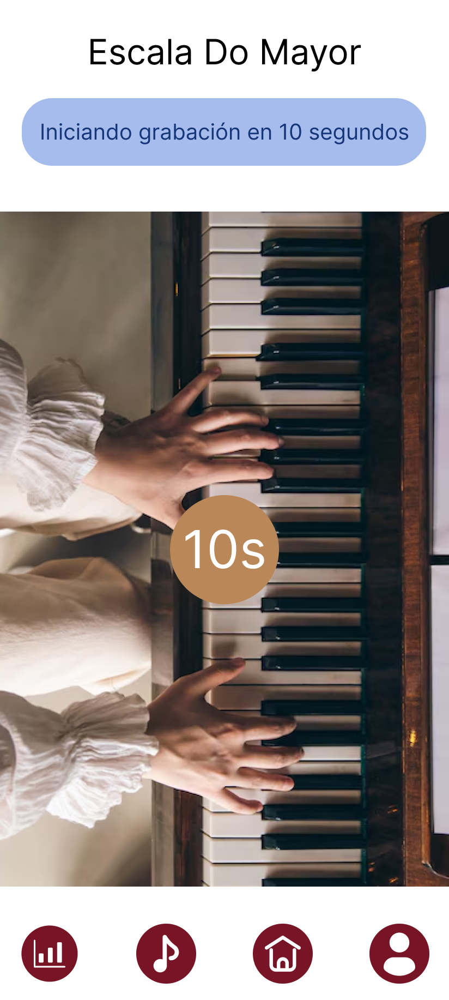
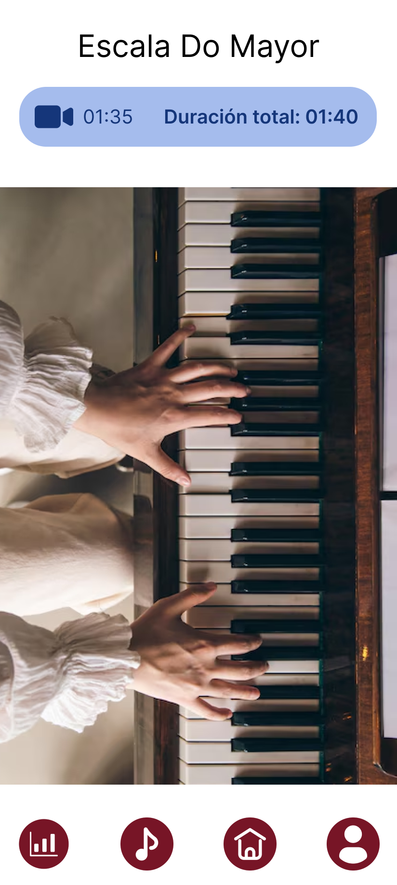
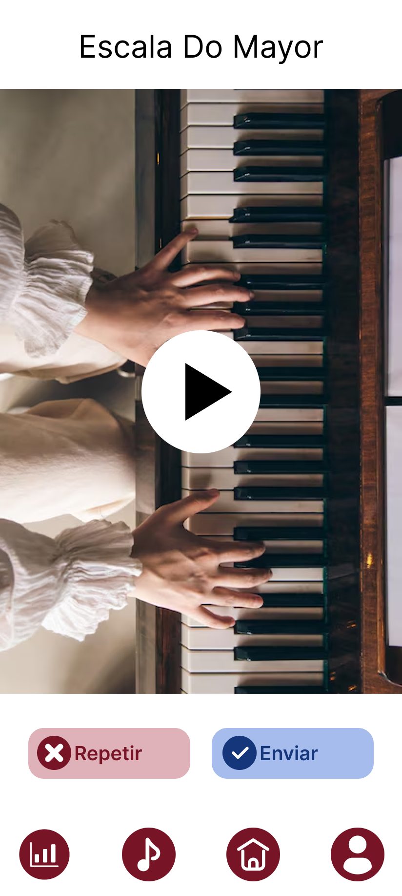
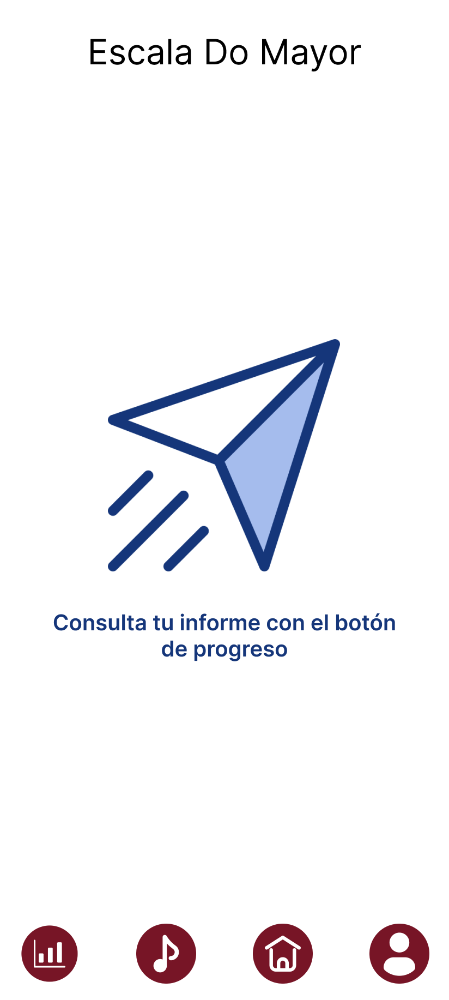

# Feature practice
This package contains features related to:

* View and select scales to practice
* Record a practice session
* Reproduce the video recorded
* Send the video to the server

## Associated UI:

### Scales list

### Speed and Distance

### Start recording

### Timer

### Recording

### Check video

### Finish video
